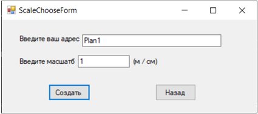
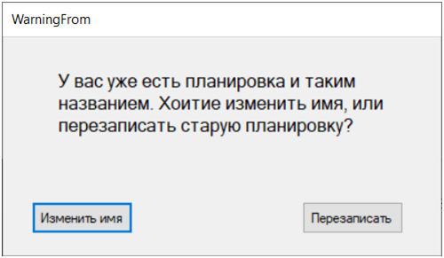

<h1>My Planner program project</h1> 

<h3>Second course project</h3>

    When program starts we will see simple menu
    

        
    

    If you choose "Create new planning" scale choose form will appear where your can name your planning and set scale
    

        
    

    If planning with such name already existing, you will be warned
    

        
    

