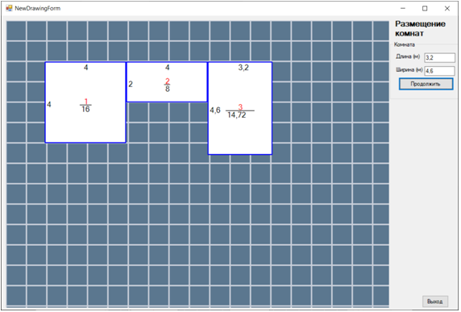
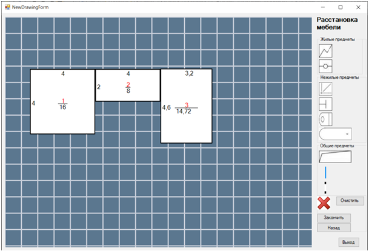

<h1>My Planner program project</h1> 

<h3>Second course project</h3>

    It is designed to create simple BTI plannings

    When program starts we will see simple menu
    

        
    

    If you choose "Create new planning" scale choose form will appear where your can name your planning and set scale
    

        
    

    If planning with such name already existing, you will be warned
    

        
    

    Then you could see form, where you can change size of your rooms and place them
    

        
    

    Rooms measurments displays in it. If you want to end planning and not all your rooms are connected, you will see warning
    

        
    

    

        
    

    If all your rooms are connected you can continue planning
    

        
    

    On the next step you can place furniture in your rooms
    

        
    

    After all furniture is placed you can save your planning
    

        
    

    Or go back to previous step and add/delete several rooms
    

        
    

    After finishing your planning you will see (according to the furniture you put in rooms) living, non living and general area of your apartment
    

        
    

    After saving you will be able to load your planning 
    

        
    

    When planning is loaded you can change everything you want and save it again
    

        
    

